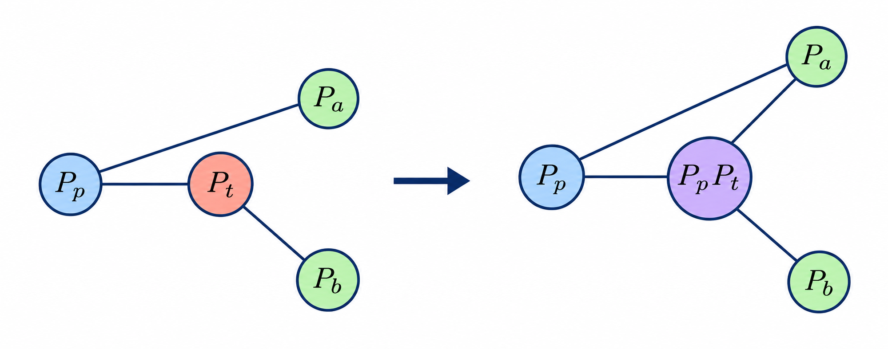
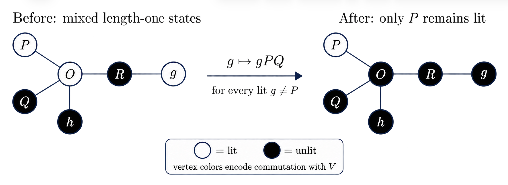
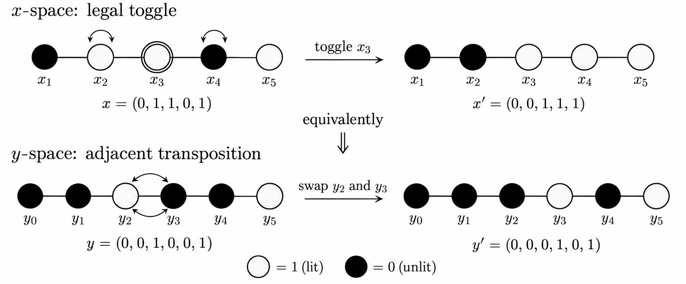
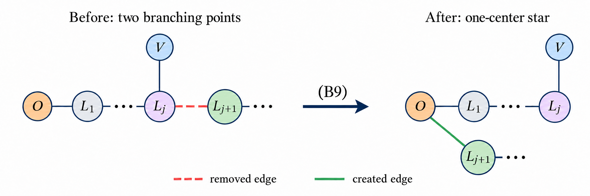
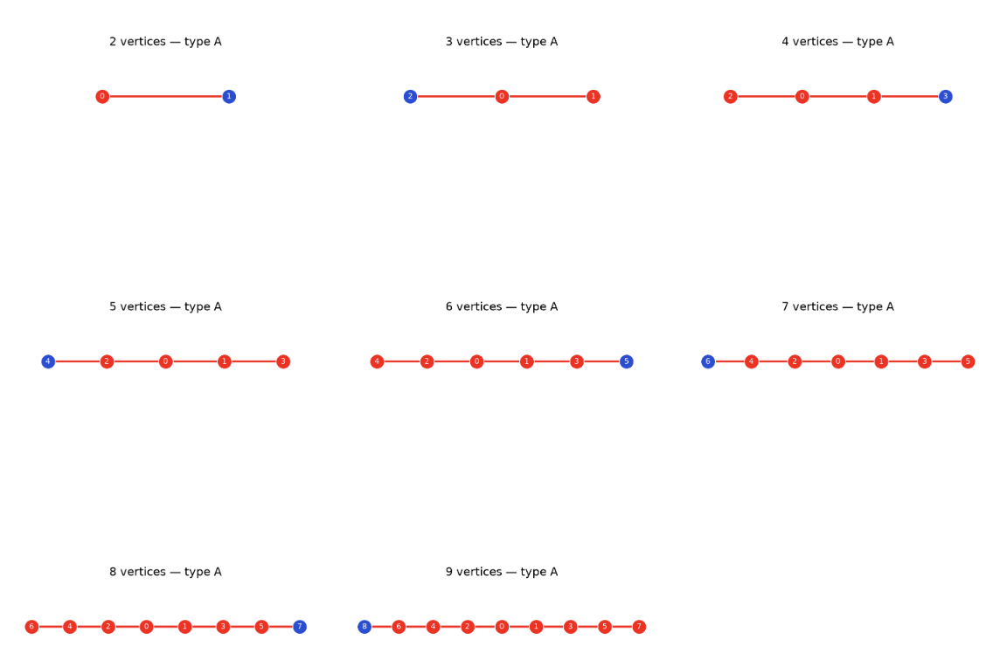
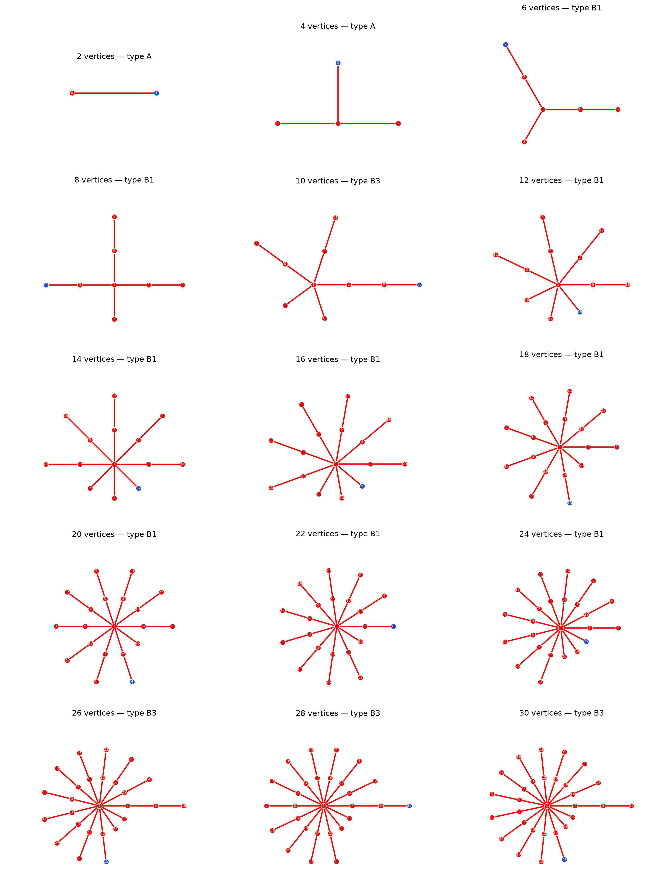

# Constructive Canonicalization of Pauli Anticommutation Graphs

**Tejas Penugonda**

## Abstract
This project implements an explicit graph-canonicalization algorithm for Lie
algebras generated by a minimal set of Pauli operators.  Its mathematical
foundation is the classification of Aguilar et al. [1](#reference) who prove that every connected Pauli anticommutation graph
can be transformed by Lie-algebra-preserving contractions into one of four
canonical families.  Their proof is inductive and provides the contraction
sequences needed for existence, but leaves the construction of an explicit
algorithm as a separate task.  Here that induction is converted into a
concrete matrix algorithm which can be helpful in several problems such as
gauging useful Lie Algebras for preparation of states in Implicit Quantum Control.  
Graphs are stored as binary adjacency matrices, contractions become XOR column and row updates, 
long certified contraction sequences are compiled into parity macros, and the evolving canonical graph is
tracked by lightweight layout metadata.  Once a canonical family is found,
the Lie-algebra type and dimension follow without explicitly constructing an
exponentially large Lie closure. A visualization tool is also provided to track the canonical graph throughout the algorithm. 
For complicated systems, this can help verify computationally that the canonical type remains invariant as the system size increases.


## Installation


Clone the repository and enter its directory. Then install the required dependencies:

```bash
python -m pip install -r requirements.txt
```
Install the package

```bash
python -m pip install .
```

Python 3.10 or later is required. Only Numpy and Matplotlib were the additional modules used for this project.

## Usage

```python
from pauli_canonicalizer import canonicalize

canonical_A, layout, order, dimension = canonicalize(A, start=0, visualization=False, step=1)
```

| Argument | Description |
| --- | --- |
| `A` | Square binary symmetric adjacency matrix with zero diagonal. |
| `start` | Starting vertex for the connected breadth-first ordering. |
| `visualization` | If `True`, store and draw the intermediate canonical graphs. |
| `step` | Include every `step`-th graph in the visualization. |

The return values are the transformed adjacency matrix, final layout metadata, processing
order, and Lie-algebra dimension. When visualization is enabled, the run writes
`canonicalization_history.txt` and `canonicalization_history.png`. A later visualized run
overwrites both files.


## Motivation and scope

Let $\mathcal G=\{P_1,\ldots,P_q\}$ be a minimal set of Pauli generators and let $
\mathfrak{g}=\langle P_1,\ldots,P_q, \ldots\rangle_{\mathrm{Lie}}$ be the corresponding Lie Algebra.
A direct calculation repeatedly forms commutators until no new Pauli operator
appears.  This is useful for small examples, but it is not scalable: the number
of basis elements can grow exponentially in $q$.

For instance, for a randomly choosen minimal set of 100 generators, the dimension of the
Lie Algebra was found to be approximately $6.33 \times 10^{29}$ (Type $B2$) using the
canonicalization algorithm. To put that into perspective, if a direct calculation was
performed by repeatedly taking commutators, at a conservative rate of trillion terms per second,
it would take longer than the age of the universe to find the dimension, set aside the memory
constraints for storing the basis. The corresponding graph method produced the result in
a few milliseconds. 

The alternative developed in [1](#reference) keeps only the pairwise
commutation data.  The anticommutation graph has one vertex for every generator
and an edge exactly when the corresponding generators anticommute.  The graph
can be reduced to a canonical representative by contractions that preserve the
generated Lie algebra.  The canonical representative determines the algebra
without enumerating its basis.

This implementation should be understood as an explicit realization of that
proof strategy. The implementation layer developed here
consists of:

- a binary adjacency-matrix representation;
- an XOR kernel for individual contractions;
- a parity compiler for contraction sequences whose net effect has
          already been proved;
- a breadth-first search for the connected ordering;
- explicit routines for the three lightning-reduction cases using clever transformation
    tricks;
- a direct sorting formulation for the type-$A$ case;
- a finite-state reduction and constant-size lookup for the type-$B$
          case; and
- a canonical cleanup routine implementing the transformations in
          Appendix B of [1](#reference).

The current implementation assumes that the input graph is connected and that
the supplied Pauli set satisfies the minimality hypothesis of Theorem 2 in
[1](#reference). Interestingly, the condition of minimality be checked using a sympletic mapping
to $\mathbb{F}_2^{2n}$, where $n$ is the number of qubits.

## TL:DR

The algorithm maintains the following invariant:

> After processing $k$ vertices, the induced graph on those vertices has been
> transformed into one of the canonical layouts $A,B1,B2,$ or $B3$.

The full procedure is:

1. Validate the binary, symmetric adjacency matrix.
1. Use breadth-first search to order the vertices as
    $v_1,\ldots,v_q$ so that every $v_{k+1}$ has a neighbour among
    $v_1,\ldots,v_k$.
1. Initialize $v_1-v_2$ as a type-$A$ path.
1. For $k=2,\ldots,q-1$, treat $V=v_{k+1}$ as a lightning on the
    current canonical graph: a processed vertex is lit precisely when it is
    adjacent to $V$.
1. Reduce this lightning to exactly one lit vertex using one of three
    cases:
    1. mixed states on the length-one legs;
    1. type $A$ with all length-one legs in the same state (using binary sort);
    1. type $B$ with all length-one legs in the same state.
1. Attach $V$ at its unique remaining neighbour and apply the canonical
    cleanup transformations.
1. Read the Lie-algebra family and dimension from the final layout.

Only binary matrix operations are performed.  The exponentially large Lie
algebra itself is never constructed.

## Binary graph formalism

### Anticommutation adjacency matrix

The graph is represented by $A\in\mathbb{F}_2^{q\times q}$, where
$$
A_{ij}=\begin{cases}
1,&\{P_i,P_j\}=0,\\
0,&[P_i,P_j]=0.
\end{cases}
$$
Thus $A=A^{\mathsf T}$ and $A_{ii}=0$.  Arithmetic on graph updates is over
$\mathbb{F}_2$, so addition is XOR.

### A single contraction

Suppose $P_p$ and $P_t$ anticommute.  Contracting the source $p$ onto the
target $t$ replaces
$$
P_t\longmapsto P'_t\propto[P_p,P_t]\propto P_pP_t.
$$
For any third generator $P_k$, the new commutation bit is
$$
A'_{kt}=A_{kt}\oplus A_{kp}.
$$
Symmetry gives $A'_{tk}=A'_{kt}$, while all entries not incident on $t$ remain
unchanged.  Therefore the implementation is simply
$$
A'_{:,t}=A_{:,t}\oplus A_{:,p},\qquad
A'_{t,:}=(A'_{:,t})^{\mathsf T},\qquad A'_{tt}=0.
$$
The legality condition $A_{pt}=1$ is essential: the XOR identity describes the
commutation pattern of a product even when the factors commute, but only an
anticommuting pair produces that product through a nonzero Lie bracket.\\

To simply put it, the net effect of contracting $P_p$ onto $P_t$, is (see Fig. 1):
- a vertex connected to $P_p$ and $P_t$, is no longer connected to $P_t P_p$.
- a vertex connected to $P_p$, but not $P_t$, is later connected to $P_t P_p$.
- all other vertices not connected to $P_p$, maintain their respective relations, with every other vertex.

<p align="center">
  
</p>

*Adjacency-graph update under the contraction $P_t\mapsto P_pP_t$.*

### Certified parity macros

Many sequences in Appendix B of [1](#reference) modify the same target
multiple times.  If a proved legal sequence has net effect
$$
P_t\longmapsto P_t\prod_{s\in S}P_s,
$$
then only the parity with which each source occurs matters.  The complete
sequence can therefore be compiled to
$$
A'_{:,t}=A_{:,t}\oplus\bigoplus_{s\in S}A_{:,s}.
$$
The routine `apply_certified_macro` performs this update once and then
copies the result to the target row.

This optimization does not assert that the sources may be contracted in
an arbitrary order. Intermediate legality may fail. This trick which results in far fewer
computations is only valid once shown the existence of a valid, albeit long, contraction
sequence.

For instance, a contraction sequence onto the target $V$ could be:

$$
\omega, L_1, O, M_1, \omega, O, L_1, M_1, O, \omega, L_1, O, M_1.
$$

However, the net affect of this toggle sequence is $V \rightarrow V \omega L_1  M_1 O$, since $P^2 = I$. It must be noted
that the corresponding macro is more a pseudo-contraction as its validity is based on the existence of a valid equivalent
one. The binary operations on the corresponding adjacency matrix, however, remain the same as those with contractions.

## Canonical layouts

The metadata object records one of the following layouts.

- **Type $A$**: A path of $n_L$ vertices, with $n_c$ extra length-one legs attached to the
    second vertex of the stored left-to-right path.

- **Type $B1$**: A star with at least one length-one leg and at least one length-two leg, and
    no legs of length three or four.

- **Type $B2$**: The same star, together with exactly one length-four leg and no length-three
    leg.

- **Type $B3$**: The same star, together with exactly one length-three leg and no length-four
    leg.

For a type-$B$ layout, a leg
$$
L=[L_1,L_2,\ldots,L_r]
$$
is stored from the center outward.  The center is denoted by $O$, and $\omega$
denotes a chosen length-one leg.

## Connected ordering and the inductive invariant

Because the input graph is connected, breadth-first search produces an order $v_1,v_2,\ldots,v_q$
such that every prefix is connected.  Equivalently, for every $k>1$, the vertex
$v_k$ has at least one neighbour in $\{v_1,\ldots,v_{k-1}\}$.  The first two
vertices therefore form an edge and initialize a type-$A$ path.

Assume the first $k$ vertices have already been canonicalized.  For
$V=v_{k+1}$ define its lightning on the active graph by
$$
x_u=A_{Vu},\qquad u\in\{v_1,\ldots,v_k\}.
$$
A vertex $u$ is called lit when $x_u=1$. Only lit vertices can be "toggled".  Contracting a lit vertex $u$ onto
$V$ replaces $V$ by $VP_u$ and toggles exactly the neighbours of $u$:
$$
x\longmapsto x\oplus A_{:,u}.
$$
The contraction is legal precisely because $x_u=1$.  Theorem 4 of
[1](#reference) guarantees that the lightning can be reduced to one lit
vertex.  The following three sections make that reduction constructive.

Simply put, toggling a lit vertex, flips the lit/unlit states of its neighbours.

The following cases deal with the problem of coming with a valid toggling sequence, that leaves only one lit vertex.

## Case 1: mixed length-one states

Suppose two length-one legs have different states.  Choose a lit leg $P$ and an
unlit leg $Q$.  These two vertices have identical neighbourhoods inside the
active canonical graph: both are adjacent only to the same center.  Hence $A_{uP}=A_{uQ}$
for every active vertex $u$.  The product $PQ$ therefore commutes with the
entire active graph.

Equation (B8) of [1](#reference) gives a legal sequence that replaces any
other generator $g$ by $g\longmapsto gPQ$ without changing the internal canonical graph.  Relative to the new vertex
$V$, however, the state of $g$ flips because $V$ anticommutes with $P$ and
commutes with $Q$.

The implementation compiles (B8) directly.  It first computes
$$
f=A_{:,P}\oplus A_{:,Q}.
$$

<p align="center">
  
</p>

The restriction of $f$ to the active vertices must vanish; this is a useful
consistency check.  For every lit $g\neq P$, it then applies
$$
A_{:,g}\longmapsto A_{:,g}\oplus f.
$$
All active vertices except $P$ become unlit, while the internal canonical graph
is unchanged.  Compared with replaying (B8) separately for each $g$, the macro
uses one precomputed XOR vector.

Simply put, let $R$ be any generator outside the active canonical graph. Since $A_{R,g'}=A_{R,g}\oplus A_{R,P}\oplus A_{R,Q},$ we have:

- If $R$ has the same relation to $P$ and $Q$, then its relation to $g$ is unchanged. This includes:
    - $R$ commuting with both $P$ and $Q$;
    - $R$ anticommuting with both $P$ and $Q$.
- If $R$ commutes with exactly one of $P,Q$ and anticommutes with the other, then its relation to $g$ is reversed:
    $$
    [R,g]=0
    \quad\Longleftrightarrow\quad
    \{R,g'\}=0.
    $$

- In particular, $V$ anticommutes with $P$ and commutes with $Q$. Therefore, replacing $g$ by $gPQ$ reverses the state of $g$ relative to $V$. Every initially lit $g\neq P$ consequently becomes unlit.

The two matching contributions cancel modulo $2$, whereas one unmatched contribution flips the commutation relation.

## Case 2: type $A$ with equal length-one states

Let the stored path be
$$
L_1-L_2-\cdots-L_m,
$$
where the additional pendants, if present, attach at $L_2$.  Their states agree
with the state of the representative length-one vertex $L_1$, so it suffices to
work on the path.

While, at initial glance, coming up with a general toggling procedure seems tedious, a
clever bijective mapping can be used to transform the problem into a linear sorting.

Write
$$
x_i=A_{V,L_i}\in\mathbb{F}_2.
$$
Introduce $m+1$ auxiliary bits $y_0,\ldots,y_m$ by choosing the gauge $y_0=0$
and defining
$$
y_i=y_{i-1}\oplus x_i,
\qquad\text{equivalently}\qquad
x_i=y_{i-1}\oplus y_i.
$$
Thus a lit path vertex is exactly a domain wall in $y$.  Toggling a legal
$L_i$ flips $x_{i-1}$ and $x_{i+1}$, which in the $y$ representation is the
adjacent transposition
$$
(y_{i-1},y_i)\longmapsto(y_i,y_{i-1}).
$$
The legality condition $x_i=1$ is exactly the condition
$y_{i-1}\neq y_i$, so every swap used by the sorting interpretation is a legal
toggle.

Consequently, lightning reduction becomes binary partition.  Sort $y$
to either
$$
11\cdots1100\cdots00
\qquad\text{or}\qquad
00\cdots0011\cdots11.
$$
The sorted sequence has one domain wall, hence the corresponding $x$ has exactly
one lit vertex.  If there are pendants and only one $1$ in $y$, the
zeros-first direction is selected so that the surviving domain wall does not
conflict with the common pendant state.  Otherwise the implementation uses the
ones-first direction.

<p align="center">
  
</p>

*Toggling a lit vertex $x_3$ is equivalent to swapping $y_{2}$ and $y_3$.*

Only the parity of the swaps across each boundary is needed.  If a $1$ at
position $i$ moves to position $r$, the boundaries $r,r+1,\ldots,i-1$ are
toggled.  A strictly linear parity compiler records this interval using an XOR
difference array,
$$
d_r\mathrel{\oplus}=1,
\qquad
d_i\mathrel{\oplus}=1,
$$
and obtains all boundary parities by one prefix XOR at the end.  This avoids
storing the potentially quadratic list of adjacent swaps.  The target $V$ is
then updated once using all path vertices whose final parity is odd.

#### Current Implementation note:
The current NumPy code repeatedly XORs slices of the parity array. Although compact, repeated slice updates have a
quadratic worst case.  Replacing them with the difference-array construction
above makes the parity computation $O(m)$ without changing the underlying math.

## Case 3: type $B$ with equal length-one states

This case follows the second half of Theorem 4 in [1](#reference), but it is
implemented as a deterministic six-stage state machine.  A local array simulates the lightning, while a parity array records which
active generators occur an odd number of times.  The global adjacency matrix
is updated only once, after the final parity is known.

### Stage 1: make the center lit

If $O$ is already lit, do nothing.  If a length-one leg $\omega$ is lit,
toggle $\omega$.  Otherwise choose a longer leg containing a lit vertex and
let $L_j$ be the innermost lit vertex.  Toggle
$$
L_j,L_{j-1},\ldots,L_1.
$$
This propagates the lightning inward until $O$ becomes lit.  The implementation
searches length-two legs first. If all are dark, only the exceptional
length-three or length-four leg needs later normalization.

### Stage 2: make every length-one leg lit

All length-one legs have the same state.  If they are dark, toggle $O$ once.
This lights every length-one leg simultaneously.

### Stage 3: make every second leg vertex dark

For each leg $L$ of length at least two, normalize $L_2$ to zero.  If only
$L_2$ is lit, toggle $L_2$, then $L_1$, then $\omega$.  If both $L_1$ and
$L_2$ are lit, toggle $L_1$ and then $\omega$.  In both branches, $L_2$ ends
dark and the center is restored to the required state.

### Stage 4: normalize the ordinary length-two legs

Choose a distinguished leg $L$: an arbitrary length-two leg in $B1$, the
length-four leg in $B2$, or the length-three leg in $B3$.  For every ordinary
length-two leg $M$ whose $M_1$ is dark, apply the compressed parity consequence
of Lemma 2, $V\longmapsto VL_2M_2.$

The preconditions $x_{L_2}=x_{M_2}=0$ are guaranteed by Stage 3.  Repeating
this step makes every ordinary $M_1$ lit.

### Stage 5: toggle the center once

At this point the length-one legs and the normalized ordinary $M_1$ vertices
are lit.  Toggling $O$ makes all of them dark simultaneously.  Any remaining
lightning is confined to the distinguished leg and the center.

### Stage 6: solve a constant-size path

The remaining problem is one of the paths
$$
O-L_1-L_2,
\qquad
O-L_1-L_2-L_3,
\qquad
O-L_1-L_2-L_3-L_4,
$$
with $O$ lit and $L_2$ dark.  There are only two relevant configurations for
$B1$, four for $B3$, and eight for $B2$.  The implementation uses a verified
lookup table of legal toggles for these constant-size cases.  The result is a
single lit vertex, after which the accumulated parity is applied to $V$ through
one certified macro.

| Type | Path | Variable state | Legal toggle sequence | Final lit vertex |
| --- | --- | --- | --- | --- |
| $B1$ | $O-L_1-L_2$ | $L_1=0$ | $\varnothing$ | $O$ |
| $B1$ | $O-L_1-L_2$ | $L_1=1$ | $L_1,L_2$ | $L_2$ |
| $B3$ | $O-L_1-L_2-L_3$ | $(L_1,L_3)=(0,0)$ | $\varnothing$ | $O$ |
| $B3$ | $O-L_1-L_2-L_3$ | $(L_1,L_3)=(0,1)$ | $L_3,L_2,L_1$ | $L_1$ |
| $B3$ | $O-L_1-L_2-L_3$ | $(L_1,L_3)=(1,0)$ | $L_1,L_2,L_3$ | $L_3$ |
| $B3$ | $O-L_1-L_2-L_3$ | $(L_1,L_3)=(1,1)$ | $L_1,L_2$ | $L_2$ |
| $B2$ | $O-L_1-L_2-L_3-L_4$ | $(L_1,L_3,L_4)=(0,0,0)$ | $\varnothing$ | $O$ |
| $B2$ | $O-L_1-L_2-L_3-L_4$ | $(L_1,L_3,L_4)=(0,0,1)$ | $L_4,L_3,L_2,L_1$ | $L_1$ |
| $B2$ | $O-L_1-L_2-L_3-L_4$ | $(L_1,L_3,L_4)=(0,1,0)$ | $L_3,L_2,L_1,L_4,L_3,L_2$ | $L_2$ |
| $B2$ | $O-L_1-L_2-L_3-L_4$ | $(L_1,L_3,L_4)=(0,1,1)$ | $L_3,L_2,L_1$ | $L_1$ |
| $B2$ | $O-L_1-L_2-L_3-L_4$ | $(L_1,L_3,L_4)=(1,0,0)$ | $L_1,L_2,L_3,L_4$ | $L_4$ |
| $B2$ | $O-L_1-L_2-L_3-L_4$ | $(L_1,L_3,L_4)=(1,0,1)$ | $L_1,L_2,L_3$ | $L_3$ |
| $B2$ | $O-L_1-L_2-L_3-L_4$ | $(L_1,L_3,L_4)=(1,1,0)$ | $L_1,L_2$ | $L_2$ |
| $B2$ | $O-L_1-L_2-L_3-L_4$ | $(L_1,L_3,L_4)=(1,1,1)$ | $L_1,L_2,L_4,L_3$ | $L_3$ |

*Constant-size lookup table used in Stage 6. In every configuration, $O=1$ and
$L_2=0$ initially. The listed toggles are applied from left to right.*

## Canonical cleanup

After lightning reduction, $V$ is adjacent to exactly one active vertex.  The
graph must now be returned to canonical form.

### Simple attachments

Several attachments require no nontrivial transformation:

- extending the outer endpoint of a type-$A$ path preserves type $A$;
- attaching $V$ to the type-$A$ center adds a pendant;
- attaching $V$ to the center of a type-$B$ star adds a length-one leg;

### Removing a second branching point

If $V$ attaches to an internal leg vertex, the enlarged graph has two branching
points.  Equation (B9) moves the outward suffix back to the original center.
In compiled form, if $L_{j+1}$ is the first vertex beyond the attachment point,
the implementation applies
$$
L_{j+1}\longmapsto L_{j+1}\,\omega V.
$$
This removes the edge $L_j-L_{j+1}$ and creates the edge $O-L_{j+1}$.  The
result is again a one-center star.

<p align="center">
  
</p>

### Star normalization

The resulting star is normalized using Lemma 3 and equations (B2)--(B7):

1. Every leg longer than four is split.  For
    $L_1-\cdots-L_5-\cdots$, the compressed (B2) macro is
    $$
    L_5\longmapsto L_5L_1L_3.
    $$
    This produces a length-four leg and a new remaining leg beginning at
    $L_5$; the operation repeats if the remainder is still too long.

1. Repeated length-three legs are removed using (B3).  With length-three
    legs $L$ and $M$,
    $$
    L_3\longmapsto L_3L_1M_1M_3\omega.
    $$
    The leg $L$ becomes one length-two leg $(L_1,L_2)$ and one length-one leg
    $(L_3)$.

1. If one length-three leg remains, every length-four leg is split into
    two length-two legs using the compressed parity of (B7).

1. If no length-three leg remains, pairs of length-four legs are reduced
    using (B4), followed by the two legal contractions (B5)--(B6) and a final
    Lemma-2 cleanup.  In the implementation this is represented by
    $$
    L_3\mapsto L_3L_1M_1,
    \qquad
    M_2\mapsto[M_2,M_1],
    \qquad
    O\mapsto[O,M_2],
    \qquad
    M_2\mapsto M_2L_4M_4.
    $$

After these steps, the remaining leg lengths uniquely determine $B1$, $B2$, or
$B3$.  If at most one nontrivial leg remains, the star is represented more
simply as a type-$A$ path with pendants.

## Reading off the Lie algebra

Let $n_c$ be the number of additional length-one control legs.  For type $B$,
let $n_2$ be the number of length-two legs.  Theorem 2 of
[1](#reference) gives the following classification and dimensions.

| Layout | Lie algebra | Dimension |
| --- | --- | --- |
| $A$ | $\displaystyle\bigoplus_{1}^{2^{n_c}}\mathfrak{so}(n_L+1)$ | $\displaystyle 2^{n_c}\frac{n_L(n_L+1)}{2}$ |
| $B1$ | $\displaystyle\bigoplus_{1}^{2^{n_c}}\mathfrak{sp}(2^{n_2})$ | $\displaystyle 2^{n_c}\frac{d(d+1)}{2},\quad d=2^{n_2}$ |
| $B2$ | $\displaystyle\bigoplus_{1}^{2^{n_c}}\mathfrak{so}(2^{n_2+3})$ | $\displaystyle 2^{n_c}\frac{d(d-1)}{2},\quad d=2^{n_2+3}$ |
| $B3$ | $\displaystyle\bigoplus_{1}^{2^{n_c}}\mathfrak{su}(2^{n_2+2})$ | $\displaystyle 2^{n_c}(d^2-1),\quad d=2^{n_2+2}$ |

The initial 100-vertex example is actually canonicalized to $B2$ with one length-one leg,
47 length-two legs, and one length-four leg.  Thus $n_c=0$, $n_2=47$, and $\mathfrak{g}\cong\mathfrak{so}(2^{50}),$
with
$$
\dim\mathfrak{g}
=\frac{2^{50}(2^{50}-1)}{2}
\approx 6.33 \times 10^{29}.
$$
This graph calculation completed in milliseconds, whereas an explicit basis
enumeration would be physically infeasible.

## Examples and visualization

The optional visualizer records the canonical graph after each cleanup stage.
Red vertices belong to the current canonical graph, while the most recently
added vertex is highlighted in blue.

### Transverse-field Ising model

For a five-qubit transverse-field Ising model, the $2N-1=9$ generators form a
path. The graph therefore remains type $A$ throughout canonicalization.

<p align="center">
  
</p>

*Canonicalization of the five-qubit transverse-field Ising model. Every intermediate graph is of type $A$.*

### Arbitrary Anticommutation Graph

The second example uses a randomly generated connected $30\times30$
anticommutation matrix. Every second canonicalization stage is displayed, and
the final graph has canonical type $B3$.

<p align="center">
  
</p>

*Canonicalization of a random connected graph on $30$ vertices (step = 2). Every second stage is shown; the final canonical graph is of type $B3$.*

## Complexity

For $q$ generators, the adjacency matrix requires $O(q^2)$ space.  BFS
on the matrix costs $O(q^2)$.  The remaining routines perform scans of
the active layout and XOR updates of matrix columns.  With the current
representation, a conservative worst-case bound for the complete induction is
$O(q^3)$ time and $O(q^2)$ space.  The local lightning logic is linear in the
active graph size; the extra factor comes from applying global length-$q$
column updates across up to $q$ induction stages.

There is substantial room for engineering improvement:

- represent columns as packed bitsets so a length-$q$ XOR uses machine
    words rather than scalar bytes;
- use an XOR difference array in Case 2;
- batch macro sources with a reduction operation;
- process disconnected components independently.

The important point is that the running time is polynomial in the number of
input generators, not in $\dim\mathfrak{g}$.  An explicit closure must spend at least
$\Omega(\dim\mathfrak{g})$ time merely to enumerate a basis.

## Implementation map

The main functions correspond to the mathematical stages as follows:

| Function | Responsibility |
| --- | --- |
| `validate_adjacency` | Validate binary symmetry and normalize dtype |
| `contract` | Apply one legal source-to-target contraction |
| `apply_certified_macro` | Apply the parity of a proved sequence |
| `connected_vertex_order` | Construct the BFS induction order |
| `initialize_two_vertices` | Build the initial type-$A$ edge |
| `reduce_mixed_length_one_lighting` | Case 1 / equation (B8) |
| `reduce_type_a_same_lightning` | Case 2 / binary sorting |
| `reduce_type_b_same_lightning` | Case 3 / six-stage reduction |
| `canonical_clean_up` | Equations (B2)--(B7) and (B9) |
| `canonicalize_graph` | Main induction and dimension calculation |

## Suggested verification strategy

Small instances can be checked against explicit Pauli closure.  Useful
tests include:

- path graphs from the open-boundary transverse-field Ising model,
    where $n_L=2N-1$ and
    $\dim\mathfrak{g}=N(2N-1)$.
- hand-constructed examples of each of $B1$, $B2$, and $B3$.
- every Case-3 lookup-table state.
- internal attachments that force the (B9) cleanup.
- legs longer than four and repeated length-three or length-four legs.
    and
- random small connected graphs, compared with an independent explicit
    closure routine.

## Reference

<a id="reference"></a>

G. Aguilar, S. Cichy, J. Eisert, and L. Bittel,
“[Full classification of Pauli Lie algebras](https://arxiv.org/abs/2408.00081).”
